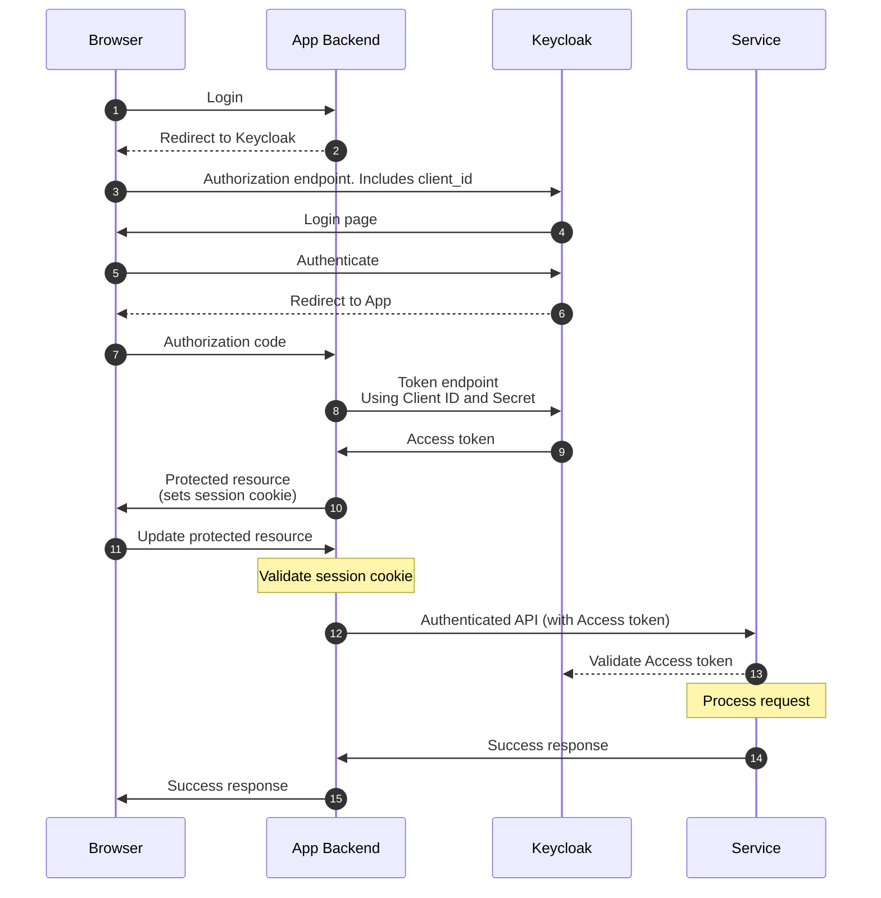
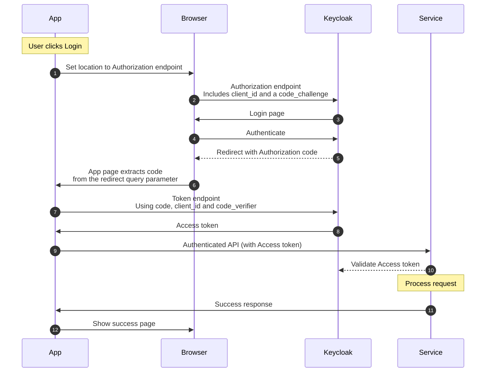

# Open Food Facts Auth

This Project provides authentication services for Open Food Facts using Keycloak, backed by a PostgreSQL database.

The primary responsibility of this service is to support user authentication and high-level authorization. Not all attributes we store about a user will be stored in Keycloak. For example, Product Opener user preferences, like whether to show barcodes, will still be stored in Product Opener.

Ultimately all user and re-user authentication should take place via Keycloak. Other Open Food Facts projects should not be prompting users for their username and password, but instead redirecting to Keycloak. This will allow us to support other authentication methods like Passkeys and social login in the future. However, username and password authentication APIs are currently still provided while all services transition.

# Configuring Clients

No clients are pre-configured in the production and staging instances. We only use OIDC clients (not SAML). Clients are configured on the `openfoodfacts` realm (not `master`).

The sequence diagrams below are provided to aid initial understanding of the login process, but app developers are advised to use established Open ID Connect (OIDC) / OAuth libraries to perform authentication.

## Private External Clients

This is the preferred option for re-users that have their own backend where a client secret and access tokens can be securely stored. The configuration in Keycloak is as follows:

* Client authentication: Enabled (this makes it a private client)
* Authentication flows: Standard flow (do not enable any other flows)
* Root URL, Home URL, Valid redirect URLs, Valid post logout redirect URIs: As specified by the client
* Web origins: +

The following diagram shows a basic login flow followed by access to a Service that requires authentication:


After the user has requested to login the app should redirect the user to the authorization_endpoint URL. The `client_id` and `redirect_uri` are included in the query parameters (amongst others) with an response_type of `code`. The `redirect_uri` must match the Redirect URL that was specified when the client was created.

Keycloak will then present the user with a Login page where they authenticate. If authentication was successful then Keycloak will redirect the browser back to the `redirect_uri` with the `code` query parameter.

The app can then call the Keycloak token endpoint with a grant_type of `authorization_code`, supplying the `code` and authenticating with the `client_id` and `client_secret`. This will return a response which will include an `access_token` and a `refresh_token`.

The `access_token` should not be returned to the browser as this creates an unnecessary security risk. It is preferred that the App Backend should generate a session cookie flagged as `Secure`, `HttpOnly` and with `SameSite=Strict`. This cookie could include an encrypted copy of the `access_token` or alternatively the `access_token` could be stored on the server and linked to the user's session.

When the user wants to perform an action that uses an authenticated API then this is relayed via the backend which will pass on the `access_token` to the service.

When the `access_token` expires the backend can request a new one using the `refresh_token` (flow not shown) which will work unless the user has logged out of that session.

## Public External Clients

This applies to can be used by clients that do not have a backend, e.g. Single Page Applications (SPAs) with just static pages or mobile apps, where all data will be stored in the browser / mobile app. Note that great care must be taken with storing access tokens and refresh tokens in the browser, and most current advice is to use a backend for frontend model to store sensitive data, but we still support this option to keep our services as open as possible.

Note that mobile apps should use an In App Browser to perform the authentication flow and not a "Web View" as the former is more secure and provides Single-SIgn-On (SSO) support across all of the user's apps.

The configuration is the same as for a private client, but Client authentication is disabled, so there is no client secret. In the following diagram the App actor could be the mobile app or just a web applications pages running in the browser. These types of app must use the Proof Key for Code Exchange (PKCE) login flow, which looks like this:


After the user has requested to login the app should redirect the user to the authorization_endpoint URL. The `client_id` and `redirect_uri` are included in the query parameters (amongst others) along with a `code_challenge` and with an response_type of `code`.

Keycloak will then present the user with a Login page where the user authenticates themselves. If authentication was successful then Keycloak will redirect the browser back to the `redirect_uri` with the `code` query parameter.

The browser app can then call the Keycloak token endpoint with a grant_type of `authorization_code`, supplying the `code` and a `code_verifier` which confirms that they were the ones that initiated the login flow. Keycloak will return a response which will include an `access_token` and a `refresh_token`.

When the user wants to perform an action that uses an authenticated API then this must include the `access_token` in the Authorization header.

When the `access_token` expires the browser app can request a new one using the `refresh_token` (flow not shown) which will work unless the user has logged out of that session. Note that `refresh_tokens` are rotated so the new `refresh_token` received after refreshing the `access_token` should replace the previous `refresh_token`.

## Internal Backend Client

This configuration would only be used for our internal clients (like Product Opener) that need to be able to perform authenticated operations in their own right (not on behalf of a user):

* Client authentication: enabled
* Authentication flows: Standard flow, Direct access grants, Service account roles
* Root URL: https://world.openfoodfacts.org/ (or as appropriate)
* Home URL: (blank)
* Valid redirect URLs: cgi/oidc_signin_callback.pl
* Valid post logout redirect URIs: cgi/oidc_signout_callback.pl
* Web origins: +

Go to the service account user for the client (e.g. service-account-off) and join the "User management" group which will assign the realm-management:manage-users and realm-management:query-users roles.

Securely share the randomly generated Client Secret with the client.

# Configuring Keycloak Users

Keycloak users are used to administer the Keyclaok system and are distinct from Open Food Facts users. Keycloak administrators are added to the master realm.

The default root user should not be used and every administrator should be a specific named individual. 

## Full Administrators

These will have access to all roles and be able to create additional users.

## Open Food Facts administrators

These will have full access to the Open Food Facts realm so can add new clients, reset user passwords, etc.

# Events

Keycloak will emit certain user events to Redis, documented [here](docs/events/openfoodfacts-auth.html)

# Components of the Project

Different aspects of the Keycloak deployment are managed by the following components of this project:

## [Customizations](src/README.md)

This is where customizations to the Keycloak server behavior are maintained. Code is written in Java. This code manages the legacy password hashing that allowed us to migrate users without them having to change their passwords and also generates Redis events for key user activities like initial registration and deletion.

## [Configuration](runtime-scripts/README.md)

These scripts apply the specific Open Food Facts configuration parameters to the Keycloak instance. This includes setting up clients for Product Opener, user attribute definitions and supported locales.

## [Themes](theme/README.md)

This is where the Keycloak UI is customized to meet Open Food Facts requirements. Most of this is done using CSS but in some cases the Keycloak templates have been overridden.

## [Localization](src/messages/README.md)

The localization message files are shared between the Java source and Themes and linked through to Crowdin.

## [Tests](tests/README.md)

We use Playwright to drive the Keycloak user interface and perform end to end testing of the Keycloak deployment.

# Local Development

First, run `make dev` to load dependencies and build the container image. Them use `make up` to start the services.

To see how a user logs in you can navigate to: http://auth.openfoodfacts.localhost:5600/realms/openfoodfacts/account/#/

For more detailed debug information you can also use the test client with the following URL:

http://auth.openfoodfacts.localhost:5604/?clientId=test-client&clientSecret=test-secret123&lang=en&keycloak=http%3A%2F%2Fauth.openfoodfacts.localhost%3A5600%2Frealms%2Fopenfoodfacts

If you create a new user account you will need to validate the email address used. The validation email can be found in SMTP4Dev here: http://localhost:5605/

# Environment

The settings in `.env` are designed to support the default local setup. Use `.envrc` to override settings locally. Descriptions of each field are included in the `.env` file.

# Applying Keycloak Updates

The Keycloak version to be used is specified `keycloak.version` property in the `pom.xml` file. However, in addition to updating this there are a number of other steps that need to be completed:

## Refresh Themes

We keep a copy of the Keycloak themes in Git so that we can see what has changed between versions. Run `make refresh_themes KEYCLOAK_VERSION=...` to refresh this copy (stored in the `theme` folder).

`make refresh_themes` is called from `make update_keycloak_version` if the `keycloak.version` property in the `pom.xml` has been changed.

Note: This requires a JRE in `$PATH`.

## Refresh Overridden Templates

We have overridden a small number of standard Keycloak templates where needed. Make sure you refresh these templates from the original Keycloak ones if they have changed and re-apply our overrides if they are still needed. All templates containing overrides will contain a comment like:

```html
<!-- OFF specific changes: ...
```

If you need to override a new template make sure it is listed in the `refresh_themes` target of the `Makefile` so that we can track further changes made by Keycloak to that template. Please try and write a Playwright test to cover any specific overrides, so we know when it is safe to remove them.

## Build

Run `make build` to update the container images.

Run `make build_testcontainer` to build the pre-configured testcontainer image used by other projects. Run `make integration_test_target` to verify that the testcontainer image deploys correctly.

## Test

Make sure you re-run the end to end tests with `make test` after a Keycloak upgrade. Pay particular attention to the screen snapshots, it is often necessary to update the custom CSS for the OFF theme after a Keycloak upgrade.

There may be some acceptable variation in screen shots, in which case you can run `make update_screenshots` to refresh these. Note that you may need to refresh these using the GitHub action on the PR by commenting with `/update-screenshots` to get exact pixel matches when running tests in GitHub.

# Roadmap

## Mobile

We will need to update the mobile application to launch the keycloak login and account pages before we can deprecate the password grant type option.

## Client Credentials for APIs

API consumers will need to be set up as Clients in Keycloak. Need to figure out how the sign-up process will work.

## Support Alternative Login

Once all apps are going through Keycloak for authentication we can start to support things like Social Login and Passkeys.

## 🎨 Design & User interface
- We strive to thoughfully design every feature before we move on to implementation, so that we respect Open Food Facts' graphic charter and nascent design system, while having efficient user flows.
- [ Keycloak user flows](https://www.figma.com/design/lQSExloZB3G2cn9acIGy6m/User-flows---Keycloak?m=auto&t=wRSYmglFiDZ8CauF-6)

